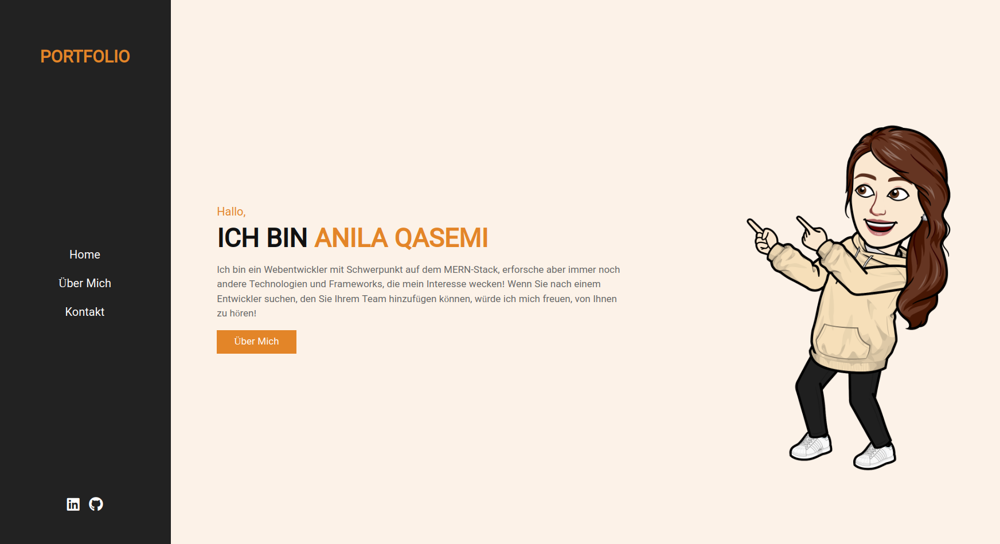

# Portfolio

Dies ist ein HTML-Code für meine Portfolio-Website (Anila Ghasemi).

Ich habe HTML, CSS und ein wenig JavaScript auf dieser Seite verwendet.

Wie ich schon erwähnt habe, wird die Website mit dem MERN-Stack erstellt.